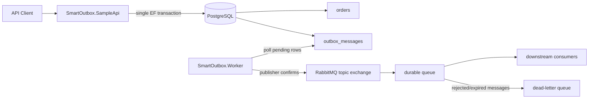
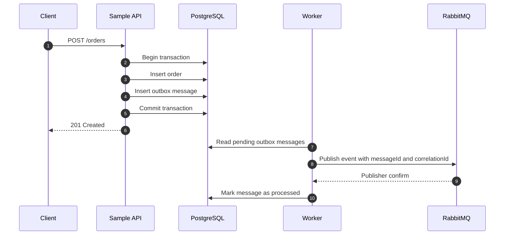

# SmartOutbox.NET

SmartOutbox.NET is a production-minded .NET 8 sample that demonstrates the Transactional Outbox Pattern with PostgreSQL, Entity Framework Core, RabbitMQ, typed publisher and consumer contracts, a background worker, structured logging, health checks, and automated tests.

The repository is intentionally small: it shows the core production concepts without hiding them behind framework noise or academic abstractions.

## Business Problem

Modern systems often need to persist business data and publish integration events. If an API writes an order to the database and then publishes an event to RabbitMQ in a separate operation, one operation can succeed while the other fails. That is the dual-write problem.

SmartOutbox.NET solves this by writing the business row and the integration event to the same database transaction. A worker later publishes pending outbox rows to RabbitMQ and marks them as processed only after the broker accepts the message.

## Architecture



Components:

- `SmartOutbox.Core`: entities, integration events, publisher/consumer contracts, serialization, correlation context, and idempotency helpers.
- `SmartOutbox.EntityFramework`: EF Core DbContext, migrations, and outbox event publisher.
- `SmartOutbox.RabbitMQ`: durable RabbitMQ topology, publisher confirms, message metadata, broker health check, and typed hosted consumers.
- `SmartOutbox.Worker`: polling background service with retry, exponential backoff, and terminal failure handling.
- `SmartOutbox.SampleApi`: order API that writes orders and outbox events atomically.
- `tests`: xUnit coverage for serialization, persistence, retry/backoff, and worker processing.

## Production Concepts Demonstrated

- Transactional Outbox Pattern
- Event-Driven Architecture
- RabbitMQ Messaging
- Retry Policies
- Exponential Backoff
- Idempotency
- Background Workers
- Health Checks
- Dockerized Environment

## Features

- Atomic order creation and event staging in one PostgreSQL transaction.
- Durable `outbox_messages` table with retry state, error details, next-attempt scheduling, and correlation IDs.
- Background worker that processes batches of pending events.
- RabbitMQ durable topic exchange, durable queue, dead-letter exchange, and dead-letter queue.
- Publisher confirmations and mandatory publish routing.
- Message ID tracking using the outbox message ID.
- Typed `IIntegrationEventPublisher` and `IIntegrationEventHandler<TEvent>` contracts for application developers.
- Consumer-side duplicate detection through `IProcessedMessageStore`.
- Structured logs with correlation IDs.
- `/healthz` endpoint for database and RabbitMQ checks.
- Docker Compose environment for PostgreSQL, RabbitMQ, API, and worker.
- Unit and integration test projects.

## Sequence Flow



## Failure Scenarios

| Scenario | Behavior |
| --- | --- |
| API crashes before commit | Neither order nor outbox message is saved. |
| API crashes after commit | Worker still finds the durable outbox row and publishes it. |
| RabbitMQ is unavailable | Worker stores the error and schedules the next attempt. |
| Message cannot be routed | Mandatory publish plus confirms surfaces the publish failure. |
| Max retries exceeded | Message is marked as terminally failed with the last error retained. |
| Consumer receives duplicate event | Consumer should deduplicate by `messageId`/event ID. |

## Retry And Backoff

The worker uses exponential backoff based on `OutboxProcessor:BackoffBaseSeconds`, capped by `OutboxProcessor:MaxBackoffSeconds`.

Example with base `5` and cap `300`:

- retry 1: 5 seconds
- retry 2: 10 seconds
- retry 3: 20 seconds
- retry 4: 40 seconds
- later retries stop at the configured cap

The next retry timestamp is stored in `NextAttemptAt`, so workers do not repeatedly hammer the same failing row.

## Idempotency

Outbox delivery is at-least-once. The worker marks a row as processed only after RabbitMQ accepts the publish, but a crash between broker publish and database update can still create a duplicate delivery. Consumers should treat `messageId` as an idempotency key and store processed IDs when side effects are not naturally idempotent.

SmartOutbox.NET includes `IntegrationEventConsumer<TEvent>` and `IProcessedMessageStore` so consumer applications can keep handler code focused on business behavior. The built-in in-memory store is for local demos; production consumers should provide a durable implementation.

## Developer Contracts

Application code publishes without knowing RabbitMQ:

```csharp
await publisher.PublishAsync(
    new OrderCreatedEvent(order.Id, order.CustomerName, order.Amount),
    cancellationToken);
```

Consumer code handles a typed event:

```csharp
public sealed class OrderCreatedHandler : IIntegrationEventHandler<OrderCreatedEvent>
{
    public Task HandleAsync(
        OrderCreatedEvent integrationEvent,
        IntegrationMessageContext context,
        CancellationToken cancellationToken = default)
    {
        return Task.CompletedTask;
    }
}
```

RabbitMQ consumers can be hosted with:

```csharp
builder.Services.AddSmartOutboxRabbitMqConsumer<OrderCreatedEvent, OrderCreatedHandler>(
    builder.Configuration);
```

More detail: [Developer Contracts](docs/developer-contracts.md).

## Scalability Considerations

- Increase `OutboxProcessor:BatchSize` for higher throughput.
- Run multiple worker replicas when the database query and row-locking strategy are strengthened for high concurrency.
- Partition event routing by topic keys when there are multiple event families.
- Keep event payloads small and immutable.
- Replace the in-memory processed-message store with a durable `IProcessedMessageStore` before handling money, inventory, email, or external API side effects.
- Use broker and database metrics to tune polling interval, batch size, and retry caps.

## Local Setup

Requirements:

- .NET 8 SDK
- Docker Desktop or compatible Docker Engine
- Optional: `dotnet-ef` for manual migrations

Build and test:

```bash
dotnet build SmartOutbox.NET.sln
dotnet test SmartOutbox.NET.sln
```

Run with the SDK:

```bash
docker compose up -d postgres rabbitmq
dotnet run --project src/SmartOutbox.SampleApi/SmartOutbox.SampleApi.csproj
dotnet run --project src/SmartOutbox.Worker/SmartOutbox.Worker.csproj
```

RabbitMQ Management UI:

- URL: `http://localhost:15672`
- User: `guest`
- Password: `guest`

## Docker Instructions

Run the full environment:

```bash
docker compose up --build
```

Services:

- API: `http://localhost:5000`
- Health check: `http://localhost:5000/healthz`
- RabbitMQ management: `http://localhost:15672`
- PostgreSQL: `localhost:5432`

Stop and remove containers:

```bash
docker compose down
```

## API Usage

Create an order:

```bash
curl -X POST http://localhost:5000/orders \
  -H "Content-Type: application/json" \
  -H "X-Correlation-ID: demo-request-001" \
  -d "{\"customerName\":\"Acme Corp\",\"amount\":1499.90}"
```

Get an order:

```bash
curl http://localhost:5000/orders/{orderId}
```

The `POST /orders` request persists the order and an `OrderCreatedEvent` outbox row in the same transaction.

## Project Structure

```text
src/
  SmartOutbox.Core/
  SmartOutbox.EntityFramework/
  SmartOutbox.RabbitMQ/
  SmartOutbox.SampleApi/
  SmartOutbox.Worker/
tests/
  SmartOutbox.UnitTests/
  SmartOutbox.IntegrationTests/
docs/
  ARCHITECTURE.md
  developer-contracts.md
  outbox-pattern.md
  rabbitmq-integration.md
  retry-and-backoff.md
```

## Documentation

- [Architecture](docs/ARCHITECTURE.md)
- [Developer Contracts](docs/developer-contracts.md)
- [Outbox Pattern](docs/outbox-pattern.md)
- [RabbitMQ Integration](docs/rabbitmq-integration.md)
- [Retry and Backoff](docs/retry-and-backoff.md)

## Future Improvements

- Add row claiming with `FOR UPDATE SKIP LOCKED` for safer multi-worker concurrency.
- Add OpenTelemetry traces and metrics.
- Add a production consumer sample with a durable inbox/idempotency table.
- Add integration tests with Testcontainers for PostgreSQL and RabbitMQ.
- Add event versioning and schema evolution guidance.
- Add formatting checks to the CI workflow.
