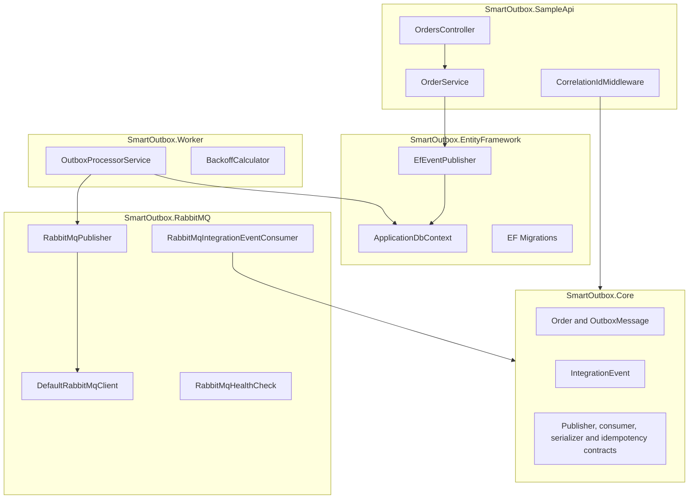

# Architecture

SmartOutbox.NET is organized as a small layered solution. The sample domain is intentionally simple so the reliability mechanics are easy to inspect.

## Component Responsibilities

`SmartOutbox.Core` owns shared contracts and stable domain concepts. It has no dependency on EF Core, ASP.NET Core, or RabbitMQ. Application developers publish through `IIntegrationEventPublisher`; consumer developers implement `IIntegrationEventHandler<TIntegrationEvent>`.

`SmartOutbox.EntityFramework` owns persistence. `EfEventPublisher` stages outbox rows but does not call `SaveChanges`, leaving transaction control with the application service.

`SmartOutbox.SampleApi` owns HTTP concerns: request validation, correlation ID capture, and order use cases.

`SmartOutbox.Worker` owns polling, retry decisions, and marking messages as processed or terminally failed.

`SmartOutbox.RabbitMQ` owns broker topology, publish reliability, and the hosted consumer bridge that turns broker deliveries into typed handlers.

## Design Decisions

- The outbox table is part of the same database as business data to guarantee atomic writes.
- Publishing is asynchronous and handled outside the request path.
- The outbox message ID is used as the RabbitMQ `messageId` for consumer idempotency.
- Correlation IDs are captured from `X-Correlation-ID` and stored on outbox messages.
- RabbitMQ topology is declared by the publisher at startup for local reliability and simple operations.
- Consumer handlers are framework-agnostic. RabbitMQ is an adapter around `IntegrationEventConsumer<TIntegrationEvent>`.

## Tradeoffs

- Polling is simple and reliable, but less immediate than database notifications.
- The worker currently processes rows without a database row-claim mechanism; this is fine for a small sample but should be strengthened before running many worker replicas.
- The built-in in-memory processed-message store is for samples; durable consumer idempotency should live in the consumer database.
- Terminal failures are stored in the outbox table rather than moved to a separate database table.

## Limitations

- No distributed tracing exporter is configured.
- No Testcontainers-based broker/database integration tests are included.
- No event schema registry or versioning system is included.
- No full production consumer application with a durable inbox table is included.
