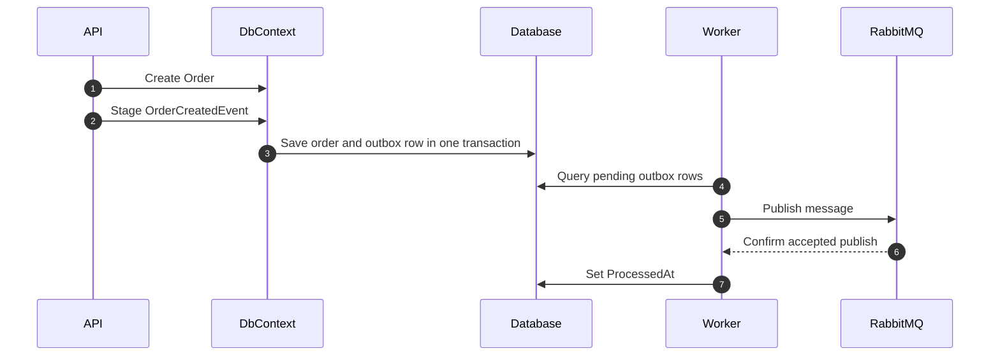

# Transactional Outbox Pattern

The transactional outbox pattern prevents dual-write inconsistency when a service must update its database and publish an integration event.

## Outbox Row

`OutboxMessage` stores:

- `Id`: durable message ID and idempotency key.
- `Type`: integration event type and RabbitMQ routing key.
- `Payload`: JSON event body.
- `CreatedAt`: original event creation timestamp.
- `ProcessedAt`: publish completion marker.
- `RetryCount`: number of failed publish attempts.
- `Error`: last publish error.
- `NextAttemptAt`: retry scheduling timestamp.
- `CorrelationId`: request trace identifier.

## Design Decisions

- `EfEventPublisher` does not call `SaveChanges`.
- The application service owns the transaction boundary.
- The worker publishes only rows where `ProcessedAt` is null and `NextAttemptAt` is due.
- Events are serialized using the runtime type so derived event payloads are preserved.

## Failure Handling

- If the database transaction fails, no event is published.
- If the API crashes after commit, the worker still publishes the durable outbox row.
- If RabbitMQ fails, the row remains pending and is retried.
- If the worker crashes after publishing but before updating `ProcessedAt`, the message may be republished.

## Idempotency

The outbox pattern provides at-least-once delivery, not exactly-once delivery. Consumers must be idempotent. The simplest strategy is to store processed `messageId` values and skip duplicates.

## Tradeoffs

- Strong local consistency with simple operational mechanics.
- Extra table, worker, and cleanup responsibility.
- Event delivery is asynchronous.
- High-scale multi-worker scenarios need row claiming or locking refinements.
