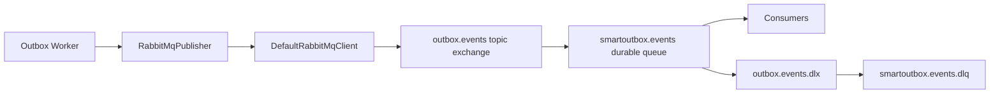

# RabbitMQ Integration

SmartOutbox.NET publishes outbox events to RabbitMQ through a durable topic exchange.

## Topology

- Exchange: `outbox.events`
- Exchange type: `topic`
- Queue: `smartoutbox.events`
- Binding key: `#`
- Dead-letter exchange: `outbox.events.dlx`
- Dead-letter queue: `smartoutbox.events.dlq`

All exchanges and queues are durable.

## Reliability Features

- Publisher confirmations are enabled when the channel is created.
- Publisher confirmation tracking is enabled by the RabbitMQ client.
- Messages are published with `mandatory: true`.
- Messages are persistent.
- Message ID is set from the outbox row ID.
- Correlation ID is copied from the originating HTTP request when available.
- Automatic connection and topology recovery are enabled.

## Design Decisions

- The publisher declares topology at startup so local development and demos work without manual broker setup.
- The event type is used as the routing key.
- A catch-all queue binding is used for the sample to keep the demo easy to inspect.
- Dead-letter topology is present even though the sample does not include a consumer.

## Tradeoffs

- Application-managed topology is convenient, but larger organizations often prefer broker topology managed by infrastructure automation.
- A catch-all binding is useful for demos; production systems usually bind specific event families.
- Publisher confirms add latency, but they are worth it for reliability-focused event publication.

## Limitations

- The sample does not implement consumer acknowledgements or consumer retry policies.
- The dead-letter queue is broker-level; worker terminal failures are stored in the database.
- No TLS or secret manager integration is configured for local Docker defaults.
