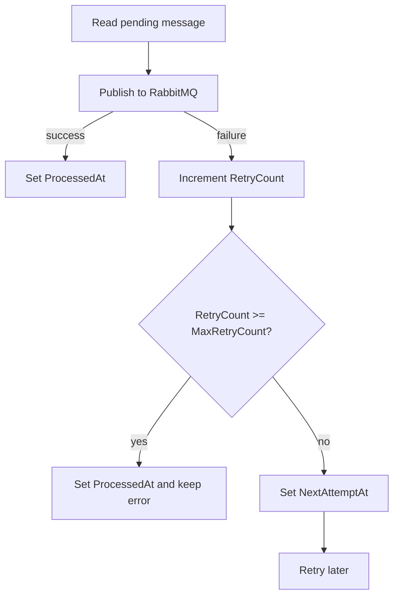

# Retry And Backoff

The worker retries transient RabbitMQ publish failures with exponential backoff.



## Calculation

`BackoffCalculator` uses:

```text
delay = min(BackoffBaseSeconds * 2 ^ (RetryCount - 1), MaxBackoffSeconds)
```

Default behavior:

- Base delay: `5` seconds
- Max retry count: `5`
- Max backoff: `300` seconds

## Why Store NextAttemptAt?

`NextAttemptAt` prevents the worker from repeatedly selecting rows that are known to be waiting for their next retry. This keeps polling simple and reduces unnecessary broker/database pressure.

## Design Decisions

- Backoff is deterministic for testability.
- Configuration is validated on startup.
- The last exception message is stored for operations visibility.
- Messages that exceed retry count are marked as terminally failed so they do not block the queue forever.

## Tradeoffs

- Deterministic backoff is easy to test, but a large fleet may benefit from jitter to avoid synchronized retries.
- Terminal failures remain in the outbox table; a separate operational table may be cleaner for large installations.
- Poison messages are not automatically replayed after terminal failure. Operators can reset `ProcessedAt`, `RetryCount`, and `NextAttemptAt` after fixing the root cause.
